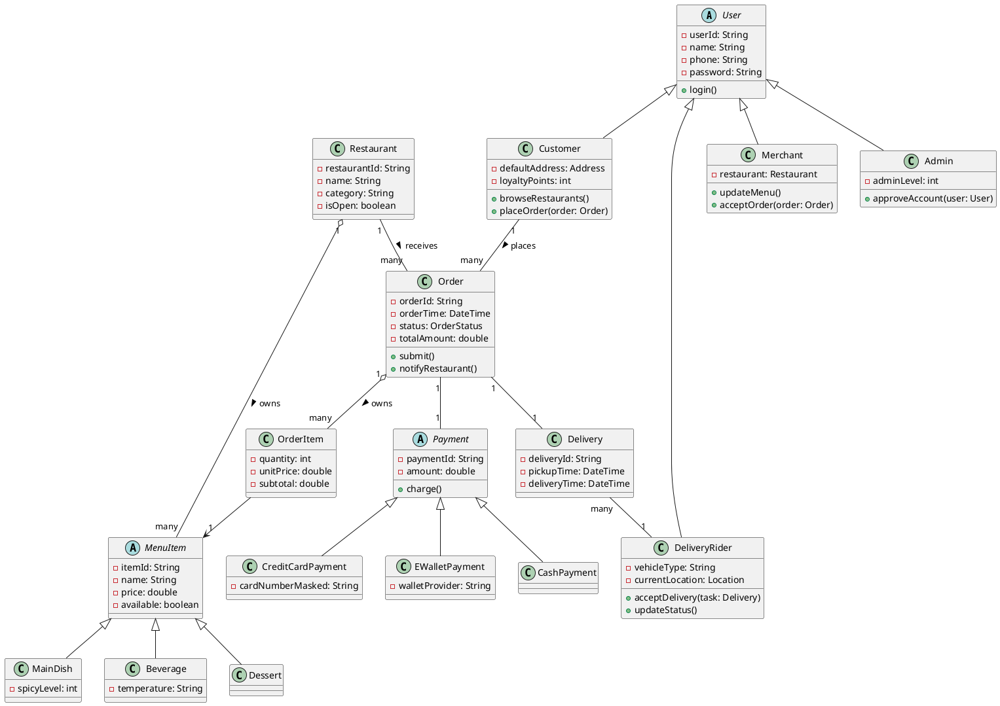
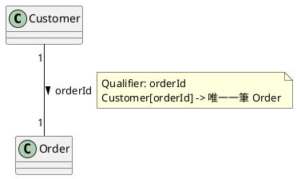

# 04 類別識別與類別圖(對應 11/21)

專題:線上點餐外送系統「FoodGo」

## 3.5.3 Class identification from use case models

### 1) 文字分析

取自 [03_劇本與使用案例.md](03_劇本與使用案例.md) 中 `PlaceOrder` 的 flow of events 文字,進行名詞/動詞/形容詞分析:

| 詞性 | 擷取自文字 | 對應到 |
|---|---|---|
| 名詞(資料) | 顧客、購物車、品項、外送地址、付款方式、訂單、金流服務、餐廳 | → **Class**:`Customer`、`ShoppingCart`、`OrderItem`、`Order`、`PaymentGateway`、`Restaurant` |
| 動詞(計算) | 檢視、確認、選擇、送出、建立、通知、顯示 | → **Function**(屬於名詞受詞的方法):`Order.submit()`、`Order.notifyRestaurant()`、`PaymentGateway.charge()` |
| 形容詞(data) | 已成立(狀態)、外送(費)、合計(金額) | → **類別內的屬性**:`Order.status`、`Order.deliveryFee`、`Order.totalAmount` |

#### 3.5.3.1 Data dictionary

| 類別 | 屬性 | 型別 | 說明 |
|---|---|---|---|
| Customer | customerId, name, phone, defaultAddress | String, String, String, Address | 顧客帳號資料 |
| Restaurant | restaurantId, name, category, address, isOpen | String, String, String, Address, boolean | 餐廳基本資料 |
| MenuItem | itemId, name, price, available | String, String, double, boolean | 菜單品項(抽象類別) |
| Order | orderId, orderTime, status, totalAmount, deliveryFee | String, DateTime, OrderStatus, double, double | 一筆訂單 |
| OrderItem | quantity, unitPrice, subtotal | int, double, double | 訂單內單一品項明細 |
| Payment | paymentId, amount, status | String, double, PaymentStatus | 付款紀錄(抽象類別) |
| DeliveryRider | riderId, name, vehicleType, currentLocation | String, String, String, Location | 外送員資料 |

#### 3.5.3.2 Class diagrams(PlantUML)

## 2) 類別關聯性(修飾上面的類別圖,須各給一個範例)

### a) 繼承(分類:父類別分成不同類型的子類別)

**範例**:`MenuItem`(父類別)依品項性質分成 `MainDish`(主餐)、`Beverage`(飲料)、`Dessert`(甜點)三個子類別。三者共用 `itemId`、`name`、`price` 等屬性與行為,但各自有專屬屬性(例如 `Beverage.temperature` 冰/熱)。

### b) 擁有(分解:一類別內擁有另一個類別的物件)

**範例**:`Restaurant` 擁有多個 `MenuItem`(一間餐廳有多道菜);`Order` 擁有多個 `OrderItem`(一筆訂單有多筆明細)。這是**聚合(aggregation)**關係,`MenuItem`/`OrderItem` 是 `Restaurant`/`Order` 的組成部分。

### c) 類別 Qualification(找出資料的 key)

**範例**:`Customer` 與 `Order` 之間原本是 1 對多關聯(一位顧客有多筆訂單)。加入 **Qualifier**`orderId` 後,關聯變成:`Customer` 透過 `orderId` 這把 key,從自己的訂單集合中**直接定位到唯一一筆** `Order`,不需要逐筆搜尋。

