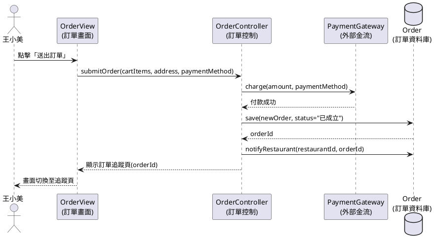
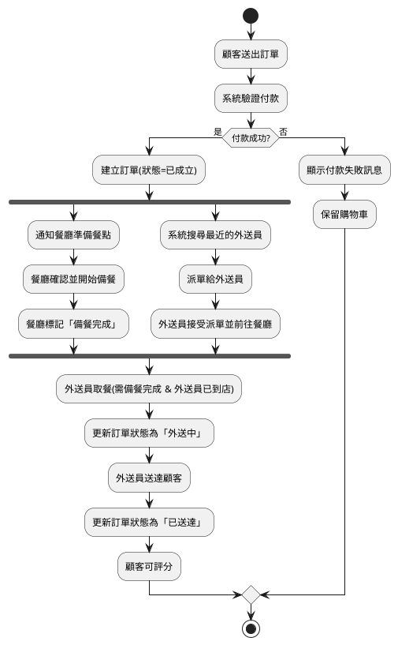

# 05 Dynamic Models:循序圖與活動圖(對應 11/28)

專題:線上點餐外送系統「FoodGo」

## 3.5.5 Dynamic models — Sequence diagram(MVC)

規定:Sequence diagram 必須包含 MVC 三種物件,依序為 **Actor → View(介面) → Control(計算) → Model(資料庫)**。

以 `PlaceOrder`(顧客下訂單)為例:

- **Actor**:王小美(顧客)
- **View**:`OrderView` 負責畫面呈現與使用者互動(Boundary Object)
- **Control**:`OrderController` 負責訂單邏輯運算、呼叫金流(Control Object)
- **Model**:`Order` 資料庫負責訂單資料存取(Entity Object)

---

## Activity Diagram(含 Concurrency 設計)

規定:Activity Diagram 需描繪系統工作流程(workflow),並且必須包含 **Concurrency(並行)**設計。

以「訂單成立後」的流程為例:訂單成立後,系統需要**同時**通知餐廳準備餐點、**同時**派單給外送員,兩件事並行處理,待兩者都完成後才進入「外送中」狀態。

`fork` / `end fork` 區塊即代表「通知餐廳備餐」與「派單給外送員」兩條流程**並行(concurrent)**執行,兩者都完成後才會合流進入「外送員取餐」步驟。
