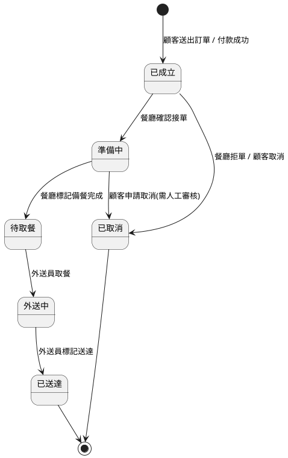

# 06 StateChart Diagram 與 Navigation Path(對應 12/5)

專題:線上點餐外送系統「FoodGo」

## StateChart Diagram(relates events and states for one class)

選定類別:**`Order`(訂單)**,描述其狀態隨事件變化的過程。



| 狀態 | 說明 |
|---|---|
| 已成立 | 付款完成,訂單建立,等待餐廳確認 |
| 準備中 | 餐廳已接單並開始備餐 |
| 待取餐 | 餐點備妥,等待外送員取餐 |
| 外送中 | 外送員已取餐,前往顧客地址途中 |
| 已送達 | 顧客已收到餐點,訂單完成 |
| 已取消 | 訂單於送達前被取消(不可逆) |

---

## Navigation Path(樹狀結構,代表系統功能選項)

以「顧客端 App」為例:

```
FoodGo App(首頁)
├── 瀏覽餐廳
│   ├── 依地址搜尋
│   ├── 依類別篩選(小吃 / 飲料 / 甜點 …)
│   └── 餐廳詳細頁
│       ├── 菜單瀏覽
│       │   └── 加入購物車
│       └── 餐廳評價
├── 購物車
│   ├── 編輯品項數量
│   ├── 選擇外送地址
│   ├── 選擇付款方式
│   └── 送出訂單 → 訂單追蹤頁
├── 訂單
│   ├── 進行中訂單(追蹤狀態)
│   └── 歷史訂單
│       └── 訂單詳情 → 評分餐廳/外送員
├── 會員中心
│   ├── 個人資料編輯
│   ├── 常用地址管理
│   └── 付款方式管理
└── 客服 / 幫助中心
```

此導覽路徑對應 [04_類別識別與類別圖.md](04_類別識別與類別圖.md) 的類別(餐廳、菜單品項、訂單…)與 [03_劇本與使用案例.md](03_劇本與使用案例.md) 的 `PlaceOrder` 使用案例,呈現使用者由首頁到完成下單的所有功能選項路徑。
