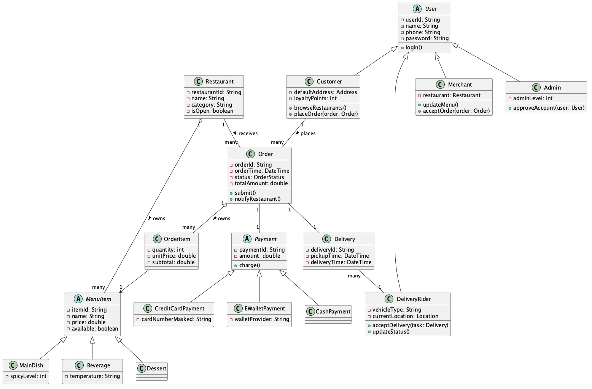
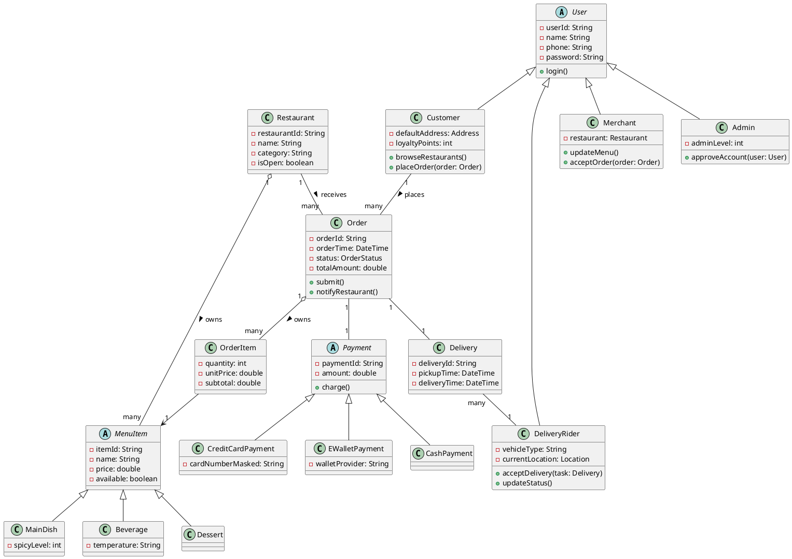
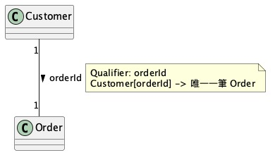
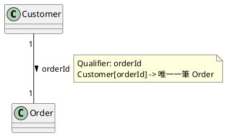
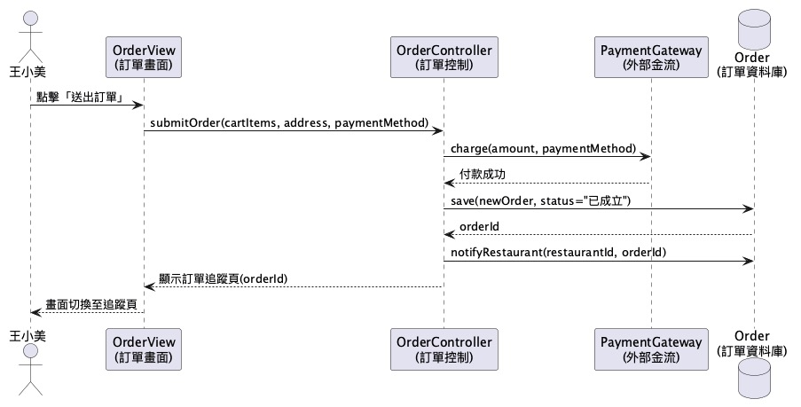
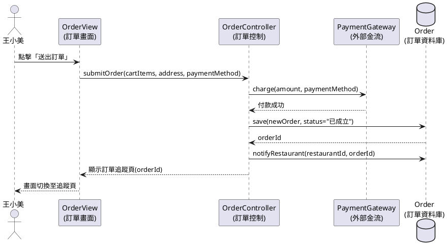
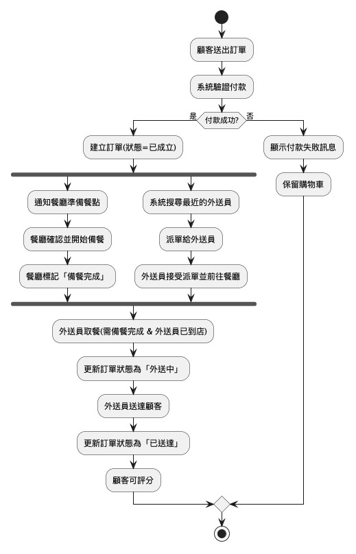
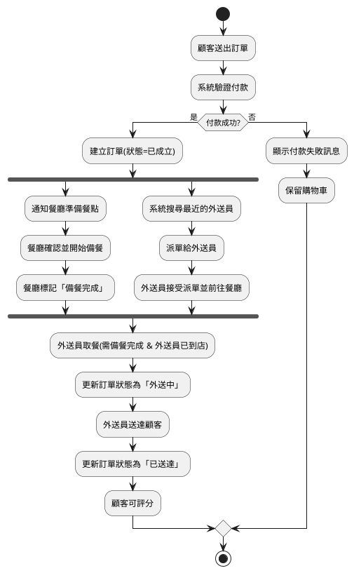
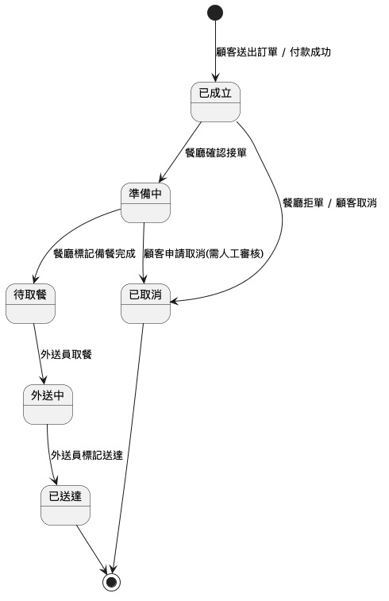
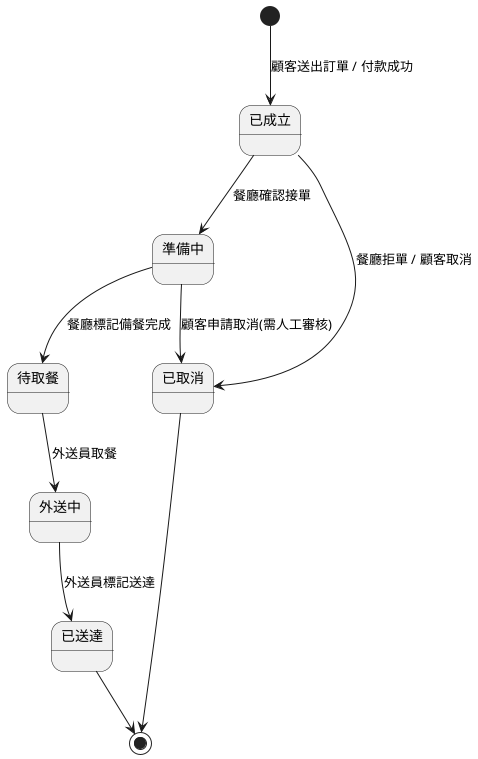

# FoodGo 專題整合報告

依照 [物件導向軟體工程作業規定.md](物件導向軟體工程作業規定.md) 的每週規定,以「線上點餐外送系統 FoodGo」為範例題目產出的整學期作業,彙整自 [01](01_專題題目與分組.md)–[06](06_狀態圖與導覽路徑.md) 六份文件。UML 圖已從 PlantUML 原始碼渲染成 JPG 圖檔(存放於 [images/](images) 目錄),方便不裝 PlantUML 工具也能直接檢視;若需要修改圖形,仍以各週分檔內的 PlantUML 原始碼為準。

---

# 01 專題題目與分組(對應 9/19、10/3)

## 9/19 分組名單與組長

---

## 10/3 專題題目

### 題目:線上點餐外送系統「FoodGo」

一個媒合「顧客」「餐廳」「外送員」的線上點餐外送平台:顧客瀏覽附近餐廳、點餐、線上付款;餐廳接單並準備餐點;系統派單給外送員送餐;顧客可即時追蹤訂單狀態。

### 對照規定的 4 個選題條件

1. **大系統**:涵蓋會員、餐廳、菜單、訂單、金流、派送、評價等多個子系統,規模足夠支撐整學期的分析與設計。
2. **創新**:可加入「多店合併訂單共乘外送」「即時路況派單」等延伸功能作為加分設計。
3. **吸引力**:外送平台是多數同學每天都會使用的服務,容易想像使用情境、容易被評審(老師/同學)理解。
4. **可實作**:核心功能(會員、菜單、訂單、狀態流轉)用一般物件導向語言(Java/Python 等)即可實作,技術門檻適中。

### 符合 OO 特性說明

| 規定要求 | FoodGo 對應 |
|---|---|
| 系統容易分析出很多不同種的資料(class) | 使用者、餐廳、菜單品項、訂單、訂單明細、付款、外送任務… |
| 系統的資料容易進一步分類(繼承) | `使用者` → `顧客` / `餐廳業者` / `外送員` / `系統管理員`;`菜單品項` → `主餐` / `飲料` / `甜點`;`付款方式` → `現金` / `信用卡` / `電子錢包` |

---

## 10/3 UML 工具建議

建議使用**線上、支援「UML 圖 ↔ 程式碼」雙向轉換**的工具,以下擇一即可:

- **PlantUML**(<https://www.plantuml.com/plantuml>):純文字描述產圖,可搭配外掛依類別圖產生 Java 骨架,版本控制(git diff)友善。本專案後續所有 UML 圖皆以 **PlantUML/Mermaid 文字碼**呈現,方便你直接貼上線上編輯器出圖。
- **StarUML** / **Visual Paradigm**:GUI 拖拉設計類別圖,可直接 Export 成 Java/C++/C# 骨架程式碼,也可以 Reverse Engineering 現有程式碼回 UML。

> 本範例採用 PlantUML/Mermaid 文字碼,對應到 [04_類別識別與類別圖.md](04_類別識別與類別圖.md) 等檔案中的圖。

---

# 02 Requirements Analysis Document(對應 10/17、11/7)

專題:線上點餐外送系統「FoodGo」

## 1. Introduction(目的、動機)

現行外食族群依賴電話訂餐或親自到店,常遇到「電話忙線」「不知道即時備餐進度」「外送人力調度不透明」等問題。FoodGo 的目的是建立一個整合「顧客下單、餐廳備餐、外送員取送」三方的線上平台,讓下單、金流、物流狀態全部可追蹤,降低溝通成本、提升外食效率。

## 2. Current system(找三個類似系統,並比較)

| 比較項目 | Uber Eats | foodpanda | 店家自建 LINE 官方帳號訂餐 |
|---|---|---|---|
| **1) 功能** | 跨店比價、即時定位追蹤、多元支付 | 訂閱制免運、跨店合併訂單 | 圖文選單點餐、人工對帳 |
| **2) 優點** | 介面成熟、覆蓋店家多 | 訂閱制對高頻使用者划算 | 導入成本低、無平台抽成 |
| **2) 缺點** | 抽成高(店家成本轉嫁顧客)、缺乏在地小吃店 | 尖峰時段派單延遲 | 無即時狀態追蹤、須人工確認付款、無法跨店比價 |

## 3. Proposed system

### 3.1 Overview

FoodGo 由三種前台角色(顧客、餐廳業者、外送員)與一個後台角色(系統管理員)共同使用同一平台:顧客瀏覽餐廳與菜單、下單並線上付款;餐廳業者管理菜單、接單、更新備餐狀態;外送員接受派單、更新取餐/送達狀態;系統管理員負責帳號審核與平台監控。所有訂單狀態變化即時同步給相關角色。

### 3.2 Functional requirements(功能性需求,10 項以上)

1. 顧客可依地址搜尋附近餐廳,並依類別/評分排序。
2. 顧客可瀏覽餐廳菜單、加入購物車、送出訂單。
3. 顧客可選擇付款方式(現金 / 信用卡 / 電子錢包)完成結帳。
4. 顧客可即時查詢訂單狀態(已成立 / 準備中 / 待取餐 / 外送中 / 已送達)。
5. 顧客可於訂單完成後對餐廳與外送員評分。
6. 餐廳業者可新增 / 編輯 / 下架菜單品項與售價。
7. 餐廳業者可接受或拒絕新訂單,並更新備餐進度。
8. 系統可依外送員目前位置與訂單地址自動指派最近的外送員。
9. 外送員可於 App 內接受派單、回報取餐與送達狀態。
10. 顧客與餐廳業者可查詢歷史訂單與消費/營收報表。
11. 系統管理員可審核新註冊的餐廳業者與外送員帳號。
12. 系統於訂單成立、狀態變更時,推播通知相關使用者。

### 3.3 Nonfunctional requirements(非功能性需求,依 L10_P.52 逐項列問答)

#### 3.3.1 User interface and human factors
**Q:系統使用者的操作能力與需求為何?**
A:顧客與外送員多用手機、操作時間零碎,介面需大按鈕、少於 3 步驟完成點餐;餐廳業者可能年齡層較高,備餐狀態更新需單鍵操作,避免複雜表單。

#### 3.3.2 Documentation
**Q:需要提供哪些文件?**
A:提供顧客端 App 使用手冊(圖文)、餐廳業者後台操作手冊、外送員 App 快速上手指南,以及給開發維運端的 API 文件。

#### 3.3.3 Hardware considerations
**Q:系統執行的硬體環境為何?**
A:顧客/餐廳/外送員三端皆以一般智慧型手機(iOS/Android)執行;後台伺服器需具備可水平擴充的雲端主機,支援尖峰時段(如晚餐時段)流量。

#### 3.3.4 Performance characteristics
**Q:系統效能要求為何?**
A:訂單送出到餐廳端收到通知需在 3 秒內完成;尖峰時段(平日 11:30-13:00、18:00-20:00)需支撐至少 5,000 併發訂單。

#### 3.3.5 Error handling and extreme conditions
**Q:系統如何處理錯誤與極端狀況?**
A:付款失敗需即時退回購物車並提示原因;若 10 分鐘內無外送員接單,系統自動擴大派單範圍並通知客服人工協助;伺服器異常時訂單資料需保有交易紀錄可回溯,不遺失已成立訂單。

#### 3.3.6 System interfacing
**Q:系統需與哪些外部系統介接?**
A:第三方金流(信用卡/電子錢包)API、地圖與路徑規劃 API、簡訊/推播通知服務(APNs/FCM)。

#### 3.3.7 Quality issues
**Q:系統在可靠度、可用度上的要求為何?**
A:系統可用度需達 99.5% 以上(每月停機時間 < 3.6 小時);訂單與金流資料需每日備份,避免資料遺失。

#### 3.3.8 System modifications
**Q:未來預期會有哪些擴充或修改?**
A:預期未來新增「多店合併訂單」「訂閱免運方案」「即時聊天客服」等功能,系統設計需保留擴充空間(例如付款方式、菜單品項皆以繼承結構設計,方便新增子類別)。

#### 3.3.9 Physical environment
**Q:系統的實體使用環境為何?**
A:顧客可能在室內、戶外、移動中使用行動網路(3G/4G/5G/Wi-Fi 切換);外送員需在戶外、騎乘機車時透過語音提示接收派單資訊,避免分心。

#### 3.3.10 Security issues
**Q:系統的資安要求為何?**
A:使用者密碼需加密儲存(不可明碼);信用卡資料不落地,交由合法第三方金流代收;顧客地址等個資僅對應訂單相關角色開放存取,並符合個資法規範。

#### 3.3.11 Resources and management issues
**Q:系統營運需要哪些資源與管理機制?**
A:需要客服團隊處理爭議訂單、營運團隊審核餐廳/外送員資格、以及維運團隊監控系統效能與異常告警(如派單延遲儀表板)。

---

# 03 劇本(Scenario)與使用案例(Use Case Model)

專題:線上點餐外送系統「FoodGo」

## 3.5.1 Scenario(劇本 / 情境,讀者是顧客跟使用者)

> 選定系統功能:**顧客下訂單**
> 依規定,劇本使用者用「真實人名」,並明確描述:1) 情境中全部相關資料 2) 使用者全部介面操作動作 3) 系統全部介面及變化。

**情境標題:王小美的晚餐訂購**

晚上 6 點,住在台北市大安區的**王小美**肚子餓了,拿出手機打開 FoodGo App。

1. 王小美點開 App 首頁,**系統偵測她目前的 GPS 位置**,並在畫面上顯示「大安區」附近評分 4.0 分以上、營業中的餐廳清單(圖文卡片,含餐廳照片、名稱、評分、預估送達時間)。
2. 王小美用手指**滑動瀏覽**清單,看到「阿明滷肉飯」,**點擊**該餐廳卡片。
3. 系統**切換畫面**至「阿明滷肉飯」的菜單頁,顯示分類頁籤(主餐 / 飲料 / 甜點)與各品項的照片、名稱、價格。
4. 王小美**點擊**「滷肉飯(大)」的「+」按鈕兩次,**系統即時更新**畫面右下角購物車圖示為「2 件、小計 $120」。
5. 王小美再**點擊**「紅茶(冰)」加入 1 杯,**系統更新**購物車為「3 件、小計 $150」。
6. 王小美**點擊**購物車圖示,**系統顯示**訂單明細畫面(品項、數量、單價、小計、外送費、合計)。
7. 王小美**確認**外送地址為「台北市大安區復興南路一段 X 號」(App 記憶的常用地址),**選擇**付款方式「信用卡(尾碼 1234)」。
8. 王小美**點擊**「送出訂單」按鈕,**系統顯示**付款處理中的轉圈動畫,並向金流服務發送請款請求。
9. 付款成功後,**系統寫入**一筆新的訂單資料(訂單編號 `ORD20260919001`、狀態「已成立」),**畫面切換**至「訂單追蹤頁」,顯示目前狀態為「餐廳準備中」的進度條動畫。
10. 約 15 分鐘後,**系統推播通知**王小美的手機:「您的訂單已由外送員取餐,預計 10 分鐘後送達」,訂單追蹤頁的進度條**自動更新**至「外送中」,並顯示外送員目前在地圖上的位置。
11. 外送員送達後,**系統推播通知**「訂單已送達」,並**彈出**評分視窗讓王小美對餐廳與外送員評分(1-5 星 + 文字評語,可略過)。

---

## 3.5.2 Use case model(使用案例,讀者是系統開發工程師)

> 依規定欄位:Use case name(複合字,動詞+名詞)、Participating actors(職稱)、entry condition、flow of events(主動式句子)、exit condition、exceptions、nonfunctional requirements。

### Use Case: **PlaceOrder**

| 欄位 | 內容 |
|---|---|
| **Use case name** | PlaceOrder |
| **Participating actors** | 顧客(Customer)、訂單系統(Order System)、金流服務(Payment Gateway,外部系統) |
| **Entry condition** | 顧客已登入 App,且購物車內至少有 1 項餐點 |
| **Flow of events** | 1. 顧客檢視購物車內容。<br>2. 系統顯示品項明細、外送費與合計金額。<br>3. 顧客確認外送地址。<br>4. 顧客選擇付款方式。<br>5. 顧客送出訂單。<br>6. 系統向金流服務送出請款請求。<br>7. 金流服務回傳付款成功結果。<br>8. 系統建立新訂單,狀態設為「已成立」。<br>9. 系統通知對應餐廳有新訂單。<br>10. 系統顯示訂單追蹤頁給顧客。 |
| **Exit condition** | 訂單成功建立,狀態為「已成立」,餐廳已收到新訂單通知 |
| **Exceptions** | E1:付款失敗 → 系統顯示錯誤訊息,保留購物車內容,回到付款方式選擇畫面。<br>E2:購物車內含已下架品項 → 系統提示移除該品項後才可送出訂單。<br>E3:餐廳目前非營業時間 → 系統禁止送出訂單並提示營業時間。 |
| **Nonfunctional requirements** | 對應 3.3.4:訂單送出到餐廳收到通知需在 3 秒內完成;對應 3.3.10:付款資訊需經加密傳輸,信用卡資料不落地儲存。 |

---

# 04 類別識別與類別圖(對應 11/21)

專題:線上點餐外送系統「FoodGo」

## 3.5.3 Class identification from use case models

### 1) 文字分析

取自 [03_劇本與使用案例.md](03_劇本與使用案例.md) 中 `PlaceOrder` 的 flow of events 文字,進行名詞/動詞/形容詞分析:

| 詞性 | 擷取自文字 | 對應到 |
|---|---|---|
| 名詞(資料) | 顧客、購物車、品項、外送地址、付款方式、訂單、金流服務、餐廳 | → **Class**:`Customer`、`ShoppingCart`、`OrderItem`、`Order`、`PaymentGateway`、`Restaurant` |
| 動詞(計算) | 檢視、確認、選擇、送出、建立、通知、顯示 | → **Function**(屬於名詞受詞的方法):`Order.submit()`、`Order.notifyRestaurant()`、`PaymentGateway.charge()` |
| 形容詞(data) | 已成立(狀態)、外送(費)、合計(金額) | → **類別內的屬性**:`Order.status`、`Order.deliveryFee`、`Order.totalAmount` |

#### 3.5.3.1 Data dictionary

| 類別 | 屬性 | 型別 | 說明 |
|---|---|---|---|
| Customer | customerId, name, phone, defaultAddress | String, String, String, Address | 顧客帳號資料 |
| Restaurant | restaurantId, name, category, address, isOpen | String, String, String, Address, boolean | 餐廳基本資料 |
| MenuItem | itemId, name, price, available | String, String, double, boolean | 菜單品項(抽象類別) |
| Order | orderId, orderTime, status, totalAmount, deliveryFee | String, DateTime, OrderStatus, double, double | 一筆訂單 |
| OrderItem | quantity, unitPrice, subtotal | int, double, double | 訂單內單一品項明細 |
| Payment | paymentId, amount, status | String, double, PaymentStatus | 付款紀錄(抽象類別) |
| DeliveryRider | riderId, name, vehicleType, currentLocation | String, String, String, Location | 外送員資料 |

#### 3.5.3.2 Class diagrams



<details>
<summary>PlantUML 原始碼</summary>



</details>

## 2) 類別關聯性(修飾上面的類別圖,須各給一個範例)

### a) 繼承(分類:父類別分成不同類型的子類別)

**範例**:`MenuItem`(父類別)依品項性質分成 `MainDish`(主餐)、`Beverage`(飲料)、`Dessert`(甜點)三個子類別。三者共用 `itemId`、`name`、`price` 等屬性與行為,但各自有專屬屬性(例如 `Beverage.temperature` 冰/熱)。

### b) 擁有(分解:一類別內擁有另一個類別的物件)

**範例**:`Restaurant` 擁有多個 `MenuItem`(一間餐廳有多道菜);`Order` 擁有多個 `OrderItem`(一筆訂單有多筆明細)。這是**聚合(aggregation)**關係,`MenuItem`/`OrderItem` 是 `Restaurant`/`Order` 的組成部分。

### c) 類別 Qualification(找出資料的 key)

**範例**:`Customer` 與 `Order` 之間原本是 1 對多關聯(一位顧客有多筆訂單)。加入 **Qualifier**`orderId` 後,關聯變成:`Customer` 透過 `orderId` 這把 key,從自己的訂單集合中**直接定位到唯一一筆** `Order`,不需要逐筆搜尋。



<details>
<summary>PlantUML 原始碼</summary>



</details>

---

# 05 Dynamic Models:循序圖與活動圖(對應 11/28)

專題:線上點餐外送系統「FoodGo」

## 3.5.5 Dynamic models — Sequence diagram(MVC)

規定:Sequence diagram 必須包含 MVC 三種物件,依序為 **Actor → View(介面) → Control(計算) → Model(資料庫)**。

以 `PlaceOrder`(顧客下訂單)為例:



<details>
<summary>PlantUML 原始碼</summary>



</details>

- **Actor**:王小美(顧客)
- **View**:`OrderView` 負責畫面呈現與使用者互動(Boundary Object)
- **Control**:`OrderController` 負責訂單邏輯運算、呼叫金流(Control Object)
- **Model**:`Order` 資料庫負責訂單資料存取(Entity Object)

---

## Activity Diagram(含 Concurrency 設計)

規定:Activity Diagram 需描繪系統工作流程(workflow),並且必須包含 **Concurrency(並行)**設計。

以「訂單成立後」的流程為例:訂單成立後,系統需要**同時**通知餐廳準備餐點、**同時**派單給外送員,兩件事並行處理,待兩者都完成後才進入「外送中」狀態。



<details>
<summary>PlantUML 原始碼</summary>



</details>

`fork` / `end fork` 區塊即代表「通知餐廳備餐」與「派單給外送員」兩條流程**並行(concurrent)**執行,兩者都完成後才會合流進入「外送員取餐」步驟。

---

# 06 StateChart Diagram 與 Navigation Path(對應 12/5)

專題:線上點餐外送系統「FoodGo」

## StateChart Diagram(relates events and states for one class)

選定類別:**`Order`(訂單)**,描述其狀態隨事件變化的過程。



<details>
<summary>PlantUML 原始碼</summary>



</details>

| 狀態 | 說明 |
|---|---|
| 已成立 | 付款完成,訂單建立,等待餐廳確認 |
| 準備中 | 餐廳已接單並開始備餐 |
| 待取餐 | 餐點備妥,等待外送員取餐 |
| 外送中 | 外送員已取餐,前往顧客地址途中 |
| 已送達 | 顧客已收到餐點,訂單完成 |
| 已取消 | 訂單於送達前被取消(不可逆) |

---

## Navigation Path(樹狀結構,代表系統功能選項)

以「顧客端 App」為例:

```
FoodGo App(首頁)
├── 瀏覽餐廳
│   ├── 依地址搜尋
│   ├── 依類別篩選(小吃 / 飲料 / 甜點 …)
│   └── 餐廳詳細頁
│       ├── 菜單瀏覽
│       │   └── 加入購物車
│       └── 餐廳評價
├── 購物車
│   ├── 編輯品項數量
│   ├── 選擇外送地址
│   ├── 選擇付款方式
│   └── 送出訂單 → 訂單追蹤頁
├── 訂單
│   ├── 進行中訂單(追蹤狀態)
│   └── 歷史訂單
│       └── 訂單詳情 → 評分餐廳/外送員
├── 會員中心
│   ├── 個人資料編輯
│   ├── 常用地址管理
│   └── 付款方式管理
└── 客服 / 幫助中心
```

此導覽路徑對應 [04_類別識別與類別圖.md](04_類別識別與類別圖.md) 的類別(餐廳、菜單品項、訂單…)與 [03_劇本與使用案例.md](03_劇本與使用案例.md) 的 `PlaceOrder` 使用案例,呈現使用者由首頁到完成下單的所有功能選項路徑。
